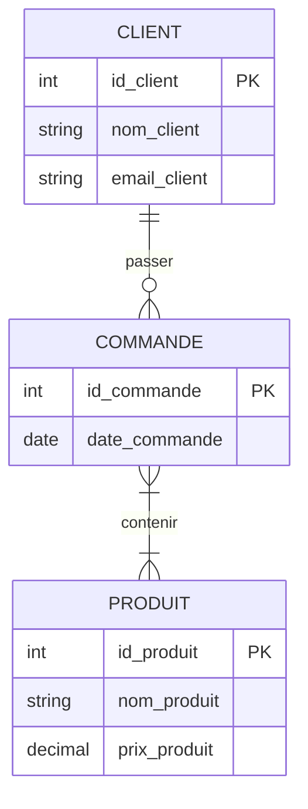

```mermaid
erDiagram

    CLIENT {
        int id_client PK
        string nom_client
        string email_client
    }

    COMMANDE {
        int id_commande PK
        date date_commande
    }

    PRODUIT {
        int id_produit PK
        string nom_produit
        decimal prix_produit
    }

    CLIENT ||--o{ COMMANDE : passer 
    COMMANDE }|--|{ PRODUIT : contenir 

```
CLIENT (0,N) ─── PASSER ─── (1,1) COMMANDE

COMMANDE (1,N) ─── CONTENIR ─── (0,N) PRODUIT